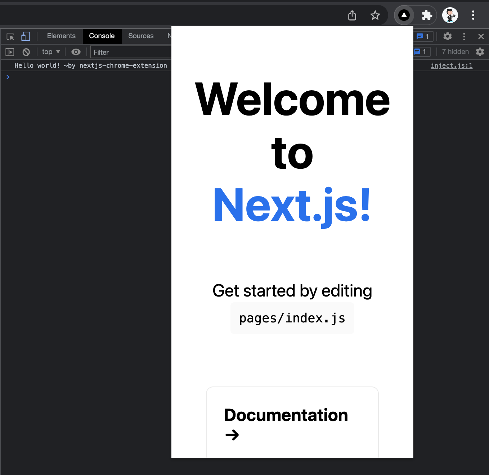

# nextjs-chrome-extension

An unopiniated starter for developing Chrome extensions using Next.js

<p align="center">

</p>
  
## Getting Started

First, install dependencies and build the project:
```bash
npm install && npm run build
```
This will create an `/out` directory that can you can add to Chrome as an extension. The `manifest.json` links `pages/index.js` to the generated `index.html`. On top of that, the `/public/inject.js` script is configured to run on any host url.

Second, start developing:
```bash
npm run dev
```
You can start editing the extension by modifying `pages/index.js` or any file in `/public`. The extension will automatically re-build as you make changes.

**🚩 Note**: [`gsed`](https://formulae.brew.sh/formula/gnu-sed#default) is used during `build` and `development` steps to bundle the project in a Chrome extension. Therefore, you will need to have this CLI installed on your development machine.
```bash
brew install gsed // homebrew installation
```

## Add extension to chrome

Open the Extension Management page by navigating to `chrome://extensions`. Enable Developer Mode by clicking the toggle switch next to Developer mode. Click the Load unpacked button and select the `/out` directory.

<p align="center">

</p>

## Learn More

To learn more about Next.js or extensions, take a look at the following resources:

- [Chrome Extensions Documentation](https://developer.chrome.com/docs/extensions/)
- [Next.js Documentation](https://nextjs.org/docs)

This template was originally inspired by the following article, [Creating a Chrome Extension with NextJS](https://aaronscherer.me/blog/post/creating-a-chrome-extension-with-nextjs).


